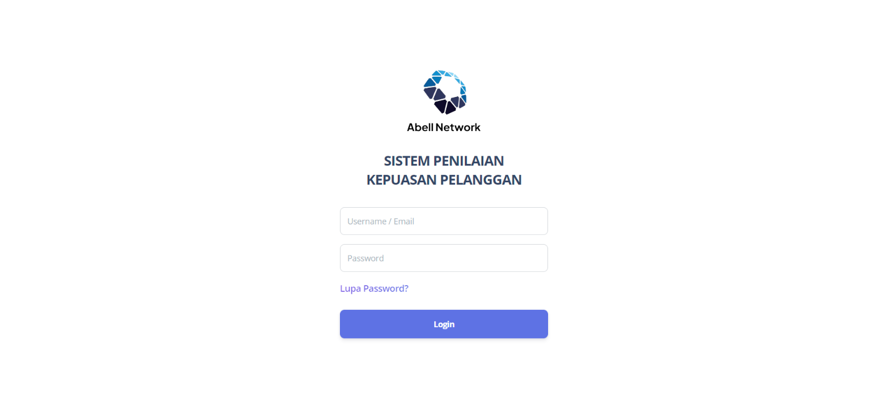
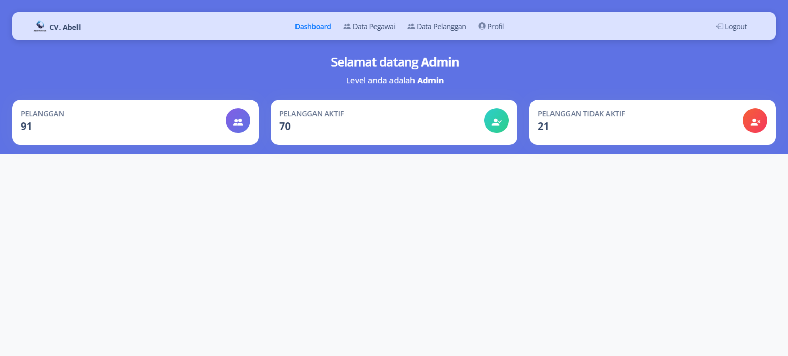
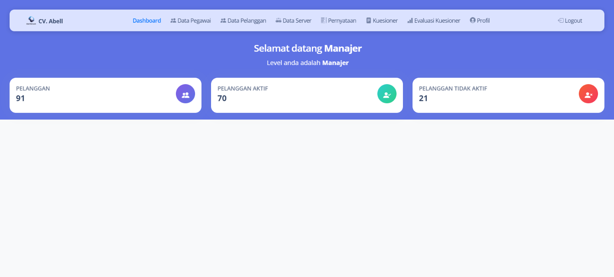
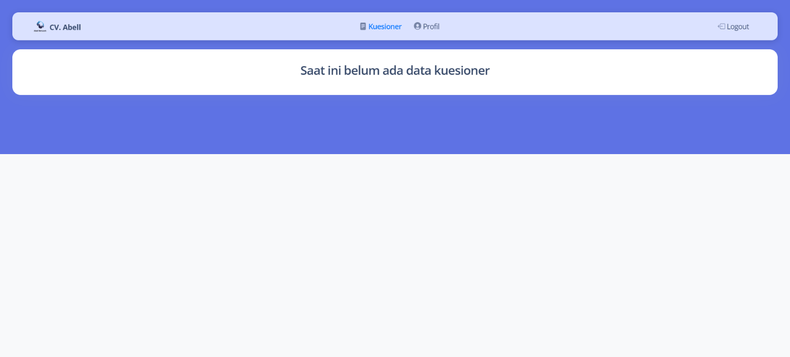

# Sistem Penilaian Kepuasan Pelanggan

Sistem Penilaian Kepuasan Pelanggan ini menggunakan metode CSI untuk memungkinkan pelanggan mengisi kuesioner yang telah disediakan. Hasil evaluasi dari jawaban pelanggan akan ditampilkan dan memberikan wawasan tentang area yang perlu diperbaiki berdasarkan umpan balik pelanggan.

-   Login Admin (username: admin, password: admin123)
-   Login Manajer (username: manajer, password: manajer123)

## Teknologi yang Digunakan

-   **Framework**: CodeIgniter 3
-   **Frontend**: Bootstrap

## Peran dan Fitur

### Peran Admin

-   **Dashboard**: Tampilan ringkasan dan statistik sistem.
-   **Manajemen Pegawai**: Melihat dan mengelola data pegawai.
-   **Manajemen Pelanggan**: Mengelola data pelanggan, termasuk fitur impor dari file Excel.
-   **Profil**: Mengatur dan memperbarui informasi profil admin.

### Peran Manajer

-   **Dashboard**: Tampilan ringkasan dan statistik sistem.
-   **Manajemen Pegawai**: Melihat dan mengelola data pegawai.
-   **Manajemen Server**: Mengelola data server.
-   **Manajemen Pernyataan**: Mengelola data pernyataan.
-   **Manajemen Kuesioner**: Membuat, mengedit, dan menerbitkan kuesioner untuk pelanggan. Melihat jawaban kuesioner yang telah diisi.
-   **Evaluasi Kuesioner**: Menganalisis hasil kuesioner untuk menentukan perbaikan yang diperlukan.
-   **Profil**: Mengatur dan memperbarui informasi profil manajer.

### Peran Pelanggan

-   **Pengisian Kuesioner**: Mengisi kuesioner dan melihat riwayat pengisian kuesioner.
-   **Profil**: Mengatur dan memperbarui informasi profil pelanggan.

## Screenshots

### Landing Page


### Login Pegawai



### Menu Admin



### Menu Manajer



### Menu Pelanggan



## Cara Instalasi

1. **Clone Repository**

    ```bash
    git clone https://github.com/adekurniawan22/cv_abell.git
    ```

2. **Instal Dependensi**

    ```bash
    composer install
    ```

3. **Siapkan Database**

    - Buat database dengan nama cv_abell.
    - Impor data SQL dari folder database ke dalam database yang baru dibuat.

4. **Konfigurasi**

    - Untuk mengubah konfigurasi database, edit file application/config/database.php.
    - Sesuaikan base_url dengan lokal server Anda di file application/config/config.php.

5. **Jalankan Website** Akses website dan masukkan URL nama_aplikasi/login-pegawai untuk mengakses halaman login pegawai.
